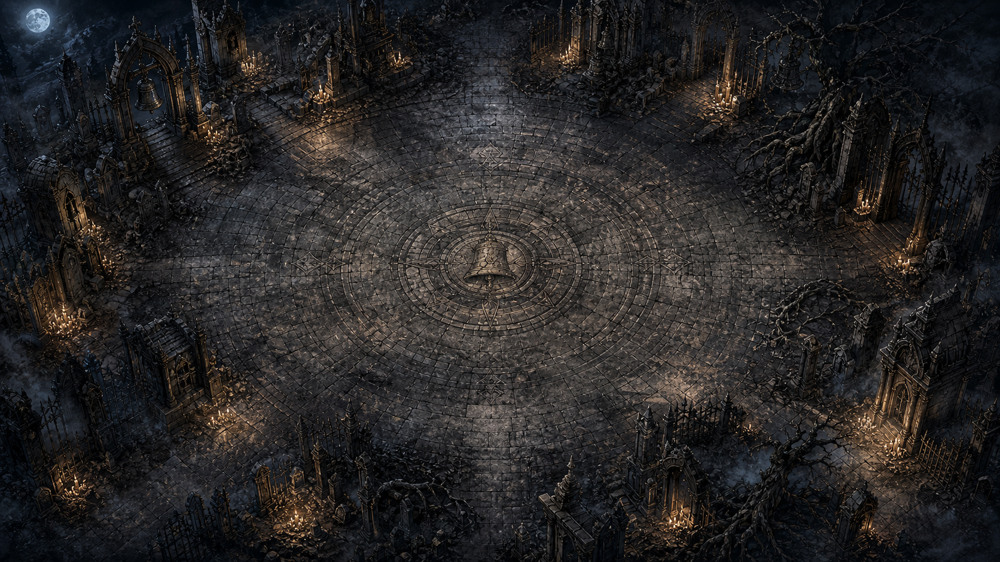

# The Twentieth Bell

A complete dark-fantasy, 20-minute survival game rendered with Three.js. A procedurally generated company fights autonomously while the player chooses transformative upgrades and rewrites each unit's fixed ability sequence.

```bash
npm install
npm run dev
# optional: run accelerated, renderless full-length balance trials
npm run balance -- 20 4 # run count, then difficulty from 1–5
```

The game includes 540 upgrade variants, five tactical oathbound doctrines, 24 sequenced abilities, 12 escalating skeleton archetypes, AP-driven mobile combat, persistent ritual zones, status interactions, reorderable ability litanies, sound, pause, responsive layout, and a true 20-minute victory condition. Hostile attacks use directional wind-up tells and visible AP for dangerous graveborn: mobile doctrines evade locked shots and committed blows, shielded guardians can choose to brace, and stun or knockback rites interrupt a committed attack. A live intent ledger counts raised blades, drawn shots, hostile ritualists, and elites before their pressure disappears into the crowd. Oathbound accumulate orbiting rite-marks as upgrades visibly rewrite them.

The visual layer uses a hand-painted 16:9 graveyard court, a twenty-frame oathbound animation atlas, a forty-eight-frame twelve-creature undead atlas, a complete 24-panel illustrated ability codex, 45 painted upgrade rites, and eight four-frame magical-effect sequences. Authored idle, opposing walk-contact, and attack or cast frames combine with deformation shaders for cloth drag, breathing, weight shifts, acceleration lean, and reactive action poses; generated effect sprites animate alongside the geometric combat tells so impact timing stays readable. Hovering or focusing an ability in the company folio opens its full illustrated dossier with AP, power, reach, recovery, and behavior. All 540 upgrade variants inherit a distinct blueprint illustration, then gain rarity framing and Ash, Blood, or Moon treatment. The same artwork carries through the live battlefield, roster dossiers, binding choices, litany reordering, opening crest, and Grave Archive so tactical identities remain consistent between combat and the GUI. The orthographic camera is deliberately pulled back to reveal the ruined cloister perimeter while status rings, AP bars, attack tells, and selected-unit marks remain geometric and readable above the painting.

Oathbound reposition themselves according to role and their next ability: vanguards intercept, guardians body-block, support units seek wounded allies, artillery kites, and skirmishers flank ranged threats. Twelve inherited origins add mechanical tradeoffs and handcrafted field relics—from orchard antlers and courier pennants to moth wings and black-star halos—to the five doctrines, producing sixty visibly and mechanically distinct procedural baselines before stats, abilities, laws, and upgrades are rolled. Skeletons answer with hounds, pikes, bows, healing cantors, standards, phasing wraiths, bishops, splitting ossuaries, and bell-bone giants, each with bespoke anatomy, equipment, and attack poses.

Upgrade paths interact with battlefield state and cast order: excess healing can become barrier, broken wards can retaliate, motion can prime melee damage, stillness can focus ranged rites, afflicted deaths can spread conditions, and alternating ability categories can braid a stronger litany. At each minute the next slain enemy drops a compact, hand-painted open reliquary that stays grounded while a four-frame sprite sequence animates only the loot's internal light; the nearest available oathbound breaks formation to retrieve it, and only then does the rite choice open. The single upgrade screen shows every possible bearer's current ordered abilities, and clicking a portrait both inspects that character and selects the recipient. Binding a rite also rekindles some health, ward, and AP, turning the recipient choice into an immediate rescue decision as well as a long-term build choice; ability order can then be rewritten from the company folio at any time.

The adaptive encounter director assembles sixteen progressively unlocked formations—including columns and attacks from opposite sides—and six authored bell processions. It watches company health, surviving roles, ritual-zone use, and battlefield crowding when choosing what answers next. Each spawned cohort keeps its file around an anchor; killing that leader breaks the formation, provokes a brief AP-fed fury, and visibly scatters its discipline. Eight procedural elite lineages alter movement, targeting, shielding, AP economy, death behavior, and mutual defense. Every company also suffers two of ten paired Grave Laws: 45 possible world-rule combinations that reshape hero and enemy tempo, movement, sustain, shielding, damage, status play, and reinforcement pressure. Discoveries persist between companies in the Grave Archive, which records all graveborn, corruptions, oathbound origins, world laws, encountered rites, run history, best performance, and per-law and law-pair mastery.

The threat curve now rises ahead of the clock during the opening bells before converging on the full final-bell values. Five Grave Pressure settings alter enemy health, damage, speed, spawn tempo, and field capacity; the deliberately severe Dread setting is selected by default. A founding ward protects the first procedural oathbound, while unchosen reinforcements arrive exactly at minutes 4, 8, 12, and 16. Fate draws missing doctrines before repeating a role so the company still develops a functional tactical shape. A generated unit begins with one offensive-capable rite, with a rare twelve-percent chance to arrive knowing two; upgrades create the later complexity. Major bells awaken clean ceremonial irises and color phases in the layered, grave-strewn arena; named benedictions mark the muster, black noon, the last vigil, and the final hours around the authored late processions. Projectiles carry directional trails, fallen archetypes leave distinct remains, and status, ward, elite, and telegraph rings stay legible without filling the arena with geometry spokes. When an oathbound falls, the survivors answer with a brief ward-and-AP death rally. Companies reduced below three survivors gain extra AP recovery—the last company is difficult to extinguish, merely very possible.


